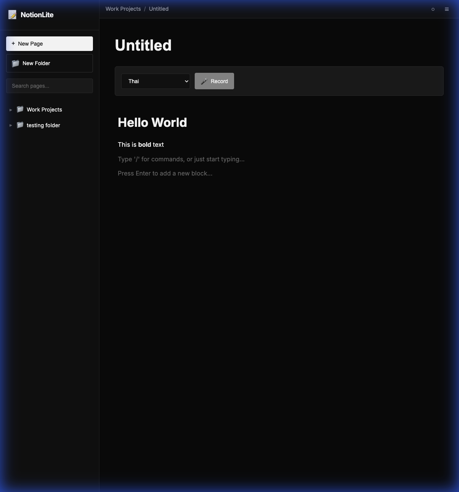

# NotionLite

A minimal, browser-based note-taking app inspired by Notion. Built with pure HTML, CSS, and JavaScript—no frameworks, no backend, no dependencies.



## ✨ Features

- **📝 Block-Based Editor** — Notion-like inline editing with automatic markdown rendering
- **🎤 Voice Memos** — Record audio with speech-to-text in 17+ languages  
- **🔗 Page Linking** — Link pages with `[[Page Name]]` syntax and view backlinks
- **📁 Folders** — Organize notes with hierarchical folders
- **🌓 Dark/Light Theme** — Monochrome design with theme toggle
- **💾 Local Storage** — All data persists in your browser
- **🖱️ Drag & Drop** — Move pages between folders by dragging

## 🚀 Quick Start

1. Clone the repository:
   ```bash
   git clone https://github.com/yourusername/notion-lite.git
   cd notion-lite
   ```

2. Open `index.html` in your browser:
   ```bash
   open index.html
   # or just double-click the file
   ```

That's it! No build step, no npm install, no server required.

## 📖 Usage

### Creating Notes
- Click **"New Page"** to create a note
- Type with markdown syntax, press **Enter** to render
- Click rendered text to edit again

### Markdown Shortcuts
```markdown
# Heading 1
## Heading 2
**bold** and *italic*
- Bullet list
1. Numbered list
> Blockquote
`code`
```

### Linking Pages
Type `[[Page Name]]` to create a link to another page. Links are clickable and backlinks are shown at the bottom.

### Voice Memos
1. Select language from dropdown
2. Click 🎤 **Record**
3. Speak your note
4. Click **Stop** → text appears
5. Click **Insert** to add to your note

### Organizing
- Create folders with **"New Folder"**
- Drag pages onto folders to move them
- Click **+** on a folder to add a page directly inside
- Right-click for rename/move/delete options

## 🎨 Theme

The app uses a monochrome design:
- **Dark mode**: Black background, white text
- **Light mode**: White background, black text

Click the ○/● button in the top bar to toggle.

## 🗂️ Project Structure

```
notion-lite/
├── index.html      # Main HTML
├── styles.css      # All styles (dark/light themes)
├── app.js          # Main controller & theme toggle
├── storage.js      # LocalStorage management
├── sidebar.js      # Navigation tree & drag-drop
├── editor.js       # Block-based markdown editor
├── linking.js      # [[Page]] link system
├── voice.js        # Voice recording & speech-to-text
└── screenshots/    # Screenshots for README
```

## 🔧 Technical Details

| Component | Technology |
|-----------|------------|
| Frontend | Vanilla HTML/CSS/JS |
| Markdown | [Marked.js](https://marked.js.org/) (CDN) |
| Storage | Browser LocalStorage |
| Voice | Web Speech API |
| Fonts | [Inter](https://fonts.google.com/specimen/Inter) (Google Fonts) |

## 🌐 Browser Support

| Browser | Supported |
|---------|-----------|
| Chrome | ✅ Full |
| Edge | ✅ Full |
| Firefox | ✅ Partial (no Speech API) |
| Safari | ✅ Partial (limited Speech API) |

> **Note**: Voice-to-text requires Chrome or Edge for full functionality.

## 📝 License

MIT License — see [LICENSE](LICENSE) file.

## 🤝 Contributing

Contributions welcome! See [CONTRIBUTING.md](CONTRIBUTING.md) for guidelines.

---

Made with ♥ and vanilla JavaScript
